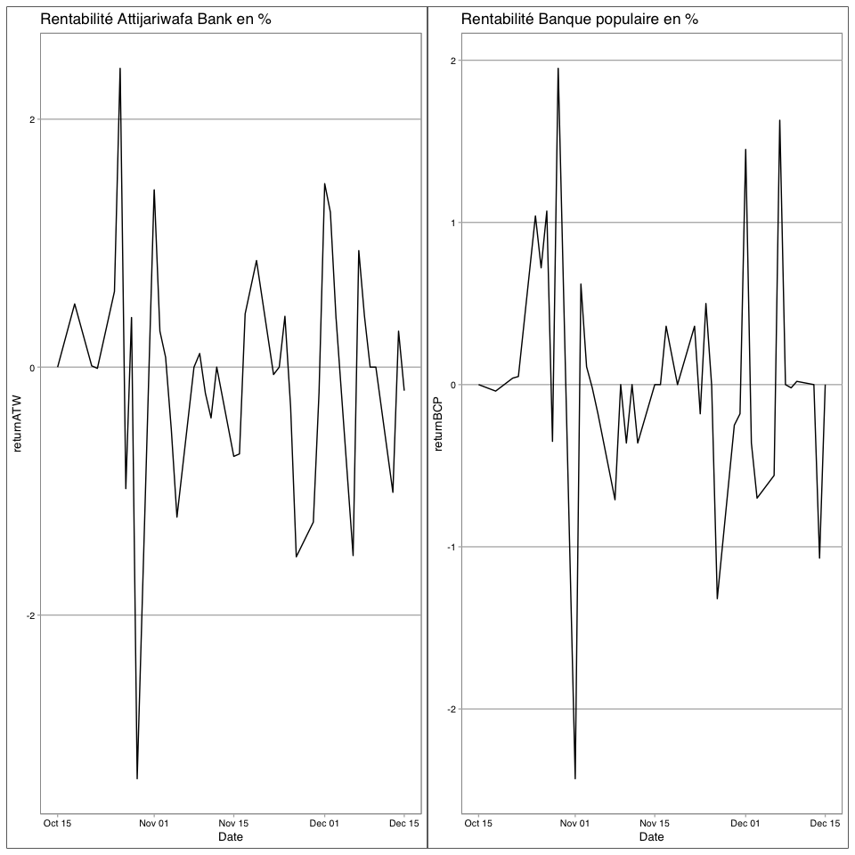

[](https://cran.r-project.org/package=casabourse)
[](https://cran.r-project.org/package=casabourse)


## Casabourse

```r
library(casabourse)
```
Casabourse est un R package qui permet d’obtenir des données à temps réel de la bourse de Casablanca. L’objectif est de faciliter l’accès aux données à tous les utilisateurs du langage de programmation R. Ce package comporte une diversité de données accessibles juste par appel de fonction.

## Guide d'installation
Ce package est disponible sur [github](https://github.com/AODiakite/casabourse) et sur le [CRAN](https://cran.r-project.org/web/packages/casabourse/index.html) pour l’installer vous devez exécuter une de ces lignes de codes :

```r
#CRAN version
install.packages("casabourse")
#Or github dev version
devtools::install_github("AODiakite/casabourse")
```

## La fonction **tickers()**
 
Cette fonction ne prend aucun argument et retourne une table de données associant chaque entreprise à un ticker. Il est important de visualiser les tickers. En effet, ils sont utilisés par les autres fonctions du package pour représenter les entreprises auxquelles ils correspondent.

```r
#' Affichage des tickers
tickers <- tickers()
head(tickers)
```

```
##   tick     codeisin
## 1 MASI         MASI
## 2  ADH MA0000011512
## 3  AFM MA0000012296
## 4  AFI MA0000012114
## 5  GAZ MA0000010951
## 6  AGM MA0000010944
```


## La fonction **msi20.data()**
 
C’est une fonction permettant de télécharger les données de l’indice MSI20. Elle renvoie une table de  données.

```r
msi20 <- msi20.data() #affection de la table MSI20 a la variable ms
msi20 #afichage des premiers elements de la table
```

```
## # A tibble: 20 × 6
##    Libellé              Place      Cours Quantité `Var.(%)` Date      
##    <chr>                <chr>      <dbl> <chr>    <chr>     <chr>     
##  1 ATLANTASANAD         Casablanca  1315 -        -         19/08/2022
##  2 ATTIJARIWAFA BANK    Casablanca   445 -        -         19/08/2022
##  3 BANK OF AFRICA       Casablanca   180 -        -         19/08/2022
##  4 BCP                  Casablanca  2599 -        -         19/08/2022
##  5 CIMENTS DU MAROC     Casablanca  1600 -        -         19/08/2022
##  6 COSUMAR              Casablanca   225 -        -         19/08/2022
##  7 DISWAY               Casablanca   736 -        -         19/08/2022
##  8 DOUJA PROM ADDOHA    Casablanca   821 -        -         19/08/2022
##  9 HPS                  Casablanca  6020 -        -         19/08/2022
## 10 ITISSALAT AL-MAGHRIB Casablanca 12135 -        -         19/08/2022
## 11 LABEL VIE            Casablanca  4620 -        -         19/08/2022
## 12 LAFARGEHOLCIM MAROC  Casablanca  1760 -        -         19/08/2022
## 13 MANAGEM              Casablanca  2021 -        -         19/08/2022
## 14 MICRODATA            Casablanca   542 -        -         19/08/2022
## 15 MUTANDIS SCA         Casablanca   230 -        -         19/08/2022
## 16 SMI                  Casablanca  1465 -        -         19/08/2022
## 17 SNEP                 Casablanca   829 -        -         19/08/2022
## 18 SODEP-Marsa Maroc    Casablanca   260 -        -         19/08/2022
## 19 SONASID              Casablanca  7575 -        -         19/08/2022
## 20 TAQA MOROCCO         Casablanca  1184 -        -         19/08/2022
```

## La fonction **masi.data()**
 
C’est une fonction permettant de télécharger les données de l’indice MASI. Elle renvoie une table de  données.

```r
#' Affichage des données de MASI
ms <- masi.data() #affection de la table MASI a la variable ms
head(ms) #afichage des premiers elements de la table
```

```
## # A tibble: 6 × 8
##   `Code Isin`  Instrument           `Nombre de titres` Cours    `Facteur flott…`
##   <chr>        <chr>                <chr>              <chr>    <chr>           
## 1 MA0000012445 ATTIJARIWAFA BANK    215 140 839,00     443,50   0,30            
## 2 MA0000011488 ITISSALAT AL-MAGHRIB 879 095 340,00     122,00   0,20            
## 3 MA0000012320 LAFARGEHOLCIM MAR    23 431 240,00      1 760,00 0,30            
## 4 MA0000011884 BCP                  203 312 473,00     258,00   0,20            
## 5 MA0000012437 BANK OF AFRICA       205 606 648,00     180,00   0,25            
## 6 MA0000012247 COSUMAR              94 487 143,00      225,00   0,40            
## # … with 3 more variables: `Facteur de plafonnement` <chr>,
## #   `Capitalisation flottante` <chr>, Poids <chr>
```


 
## La fonction **daily.data("ticker", "from", "to")** :
 
Comme son nom l’indique, cette fonction renvoie les cours journaliers d’un titre entre deux dates données par l’utilisateur. Elle reçoit trois arguments :
* ticker : qui correspond au ticker du titre qui nous intéresse ou même de l'indice MASI( pour rappelle vous pouvez connaitre tous les tickers des titres grâce à la fonction tickers() )
* from : représente la date de début de collecte de données. Cet argument est du type ‘’jour-mois-année’’.
* to : représente la date d’arrêt de collecte de données. Cet argument est du type ‘’jour-mois-année’’.
NB : Les week-end ne sont pas pris en compte lors du téléchargement des données et en plus Il est important de mettre chaque argument entre des doubles quotes( ‘’ ‘’)


```r
#Affichage des cours journaliers de ATTIJARIWAFA BANK entre 01 janvier 2017 et le 14 decembre 2021
atw <- daily.data("atw","01-01-2017","14-12-2021") #affection de la table a la variable atw
head(atw) #afichage des premiers elements de la table
```

```
##         Date   ATW
## 1 2017-08-16 449.5
## 2 2017-08-17 449.0
## 3 2017-08-18 443.0
## 4 2017-08-22 437.0
## 5 2017-08-23 437.0
## 6 2017-08-24 437.0
```

 
## La fonction **bySector()** :
 
Elle renvoie une table contenant des données par secteur d’activités. Elle est une fonction sans argument.

```r
#Afichage des données par secteur d'activité
bySector()
```

```
## # A tibble: 23 × 4
##    Secteur                                 Valeur    `Var %` `Var % 31/12`
##    <chr>                                   <chr>     <chr>   <chr>        
##  1 SYLVICULTURE & PAPIER                   41,81     1,97 %  40,25 %      
##  2 ELECTRICITE                             2 645,81  1,20 %  12,76 %      
##  3 PETROLE & GAZ                           20 241,82 1,14 %  -5,76 %      
##  4 PARTICIPATION ET PROMOTION IMMOBILIERES 3 265,21  0,80 %  -4,99 %      
##  5 DISTRIBUTEURS                           43 787,47 0,52 %  -8,45 %      
##  6 ASSURANCES                              4 974,06  0,49 %  -9,92 %      
##  7 BANQUES                                 12 982,59 0,35 %  -7,97 %      
##  8 BOISSONS                                15 140,20 -       -5,54 %      
##  9 AGROALIMENTAIRE / PRODUCTION            32 907,80 -       -11,14 %     
## 10 SERVICES AUX COLLECTIVITES              1 067,29  -       8,52 %       
## # … with 13 more rows
```

 
## La fonction **instruments()** :
 
Elle est sans argument et nous donne les informations sur les instruments financiers du marché, telles que le code ISIN, le compartiment, le nombre de titres etc.


```r
#Afichage les instruments financiers du marché
instruments()
```

```
## # A tibble: 76 × 5
##    `Code ISIN`  `Libelle instru…` `Secteur/Catég…` Compartiment `Nombre de tit…`
##    <chr>        <chr>             <chr>            <chr>        <chr>           
##  1 MA0000012296 AFMA              ACTIONS 1ERE LI… Principal B  1000000         
##  2 MA0000012114 AFRIC INDUSTRIES… ACTIONS 1ERE LI… Principal B  291500          
##  3 MA0000010951 AFRIQUIA GAZ      ACTIONS 1ERE LI… Principal A  3437500         
##  4 MA0000010944 AGMA              ACTIONS 1ERE LI… Alternatif A 200000          
##  5 MA0000011819 ALLIANCES         ACTIONS 1ERE LI… Principal B  22078588        
##  6 MA0000010936 ALUMINIUM DU MAR… ACTIONS 1ERE LI… Principal B  465954          
##  7 MA0000012460 ARADEI CAPITAL    ACTIONS 1ERE LI… Principal F  10645783        
##  8 MA0000011710 ATLANTASANAD      ACTIONS 1ERE LI… Principal A  60283595        
##  9 MA0000012445 ATTIJARIWAFA BANK ACTIONS 1ERE LI… Principal A  215140839       
## 10 MA0000010969 AUTO HALL         ACTIONS 1ERE LI… Principal A  50294528        
## # … with 66 more rows
```

 
## La classe de fonctions **today.** :
 
C’est une classe de fonctions permettant d’obtenir des informations de la date d’aujourd’hui. Nous pouvons y trouver les fonctions suivantes :

> - **today.prizelist("up_or_down")** : reçoit ‘’up’’ ou ‘’down’’ et renvoie respectivement une table de palmarès de hausse ou de baisse des cours des instruments du marché

```r
#Afichage du palmares de hausse des cours de la journée
today.prizelist('up')
```

```
## # A tibble: 38 × 7
##    Nom          Cours `1 sem. perf.%` `Max 1 sem.` `Min 1 sem.` `Quantité 1 se…`
##    <chr>        <chr> <chr>           <chr>        <chr>        <chr>           
##  1 Med Paper P  30,49 +17,27%         31,40        24,94        117 629,00      
##  2 PROMOPHARM   1 07… +10,03%         1 075,00     977,00       17,00           
##  3 Ennakl N     32,94 +7,65%          33,00        30,60        4 251,00        
##  4 Colorado P   50,22 +6,04%          51,50        45,14        16 970,00       
##  5 Alliances P  64,80 +5,87%          65,30        57,10        170 698,00      
##  6 EQDOM P      1 17… +5,77%          1 174,00     1 110,00     22,00           
##  7 S2M P        200,… +4,17%          200,00       190,00       1 595,00        
##  8 Afric Indus. 379,… +4,12%          382,00       364,00       407,00          
##  9 Sanlam Maro… 1 30… +4,00%          1 360,00     1 243,00     2 338,00        
## 10 DISWAY P     736,… +3,66%          768,90       700,50       12 909,00       
## # … with 28 more rows, and 1 more variable: `Volume 1 sem.` <chr>
```

> - **today.market()** : est sans argument et renvoie le cours actuel des instruments financier ainsi que leurs variations, leurs cours à l’ouverture, leurs max etc.

```r
#Affichage des données du marché d'aujourd'hui
today.market()
```

```
## # A tibble: 76 × 9
##    Valeur    `Date/Heure` Ouverture Cours `Variation %` Quantité Volume `+ Haut`
##    <chr>     <chr>        <chr>     <chr> <chr>         <chr>    <chr>  <chr>   
##  1 Addoha    19.08.2022   8,24      8,21  +0,12%        39 070   320 1… 8,29    
##  2 AFMA      19.08.2022   1 500,00  1 50… +1,42%        1        1 500… 1 500,00
##  3 Afric In… 19.08.2022   379,00    379,… 0,00%         5        1 895… 379,00  
##  4 Afriquia… 19.08.2022   4 996,00  4 99… +1,96%        10       49 96… 4 996,00
##  5 Agma      19.08.2022   5 600,00  5 60… 0,00%         30       168 0… 5 600,00
##  6 Alliances 19.08.2022   64,50     64,80 +1,58%        51 803   3 342… 65,30   
##  7 Aluminiu… 19.08.2022   1 557,00  1 59… +0,06%        30       47 88… 1 599,00
##  8 Aradei C… 19.08.2022   445,90    445,… +0,20%        152      67 76… 445,90  
##  9 ATLANTAS… 19.08.2022   127,80    131,… -0,38%        1 181    155 0… 131,95  
## 10 Attijari… 19.08.2022   444,00    445,… +0,34%        11 034   4 889… 445,00  
## # … with 66 more rows, and 1 more variable: `+ Bas` <chr>
```

> - **today.transactions()** : permet d’obtenir une table des transactions de la journée. Elle est une fonction sans argument.

```r
#Affichages des transactions de la journée
today.transactions()
```

```
## # A tibble: 50 × 5
##    Heure    `Insturment financier`  Cours  Quantité Volume    
##    <chr>    <chr>                   <chr>  <chr>    <chr>     
##  1 15:39:41 SODEP-Marsa Maroc       260,00 84,00    21 840,00 
##  2 15:39:41 DELATTRE LEVIVIER MAROC 55,00  13,00    715,00    
##  3 15:39:32 MUTANDIS SCA            230,00 454,00   104 420,00
##  4 15:39:10 MUTANDIS SCA            230,00 177,00   40 710,00 
##  5 15:39:07 MUTANDIS SCA            230,00 1 054,00 242 420,00
##  6 15:38:49 ALLIANCES               64,80  23,00    1 490,40  
##  7 15:38:49 ALLIANCES               64,80  12,00    777,60    
##  8 15:38:45 DELATTRE LEVIVIER MAROC 55,00  2,00     110,00    
##  9 15:38:34 MUTANDIS SCA            230,00 2 000,00 460 000,00
## 10 15:37:53 DELATTRE LEVIVIER MAROC 55,00  242,00   13 310,00 
## # … with 40 more rows
```

## Exemples d'utilisations de la library(casabourse) :
> - Nous allons tracer la courbe de variations des cours des titres de Attijariwafa Bank et de la Banque Populaire du Maroc entre le début de l’année 2020 et le 15 décembre 2021.


```r
#lecture des données de Attijariwafa Bank
atw <- daily.data(ticker = "ATW", from = "01-01-2020", to = "15-12-2021")
#lecture des données de la Banque Populaire du Maroc
bcp <- daily.data(ticker = "BCP", from = "01-01-2020", to = "15-12-2021")
data=merge(atw,bcp, by = "Date")

plot_ATW =  ggplot(data = data, aes(x = Date,y = ATW))+
  geom_line()+
  labs(title = "Attijariwafa Bank")+
  ggthemes::theme_calc()# Pour changer de theme

plot_BCP=  ggplot(data = data, aes(x = Date,y = BCP))+
  geom_line()+
  labs(title = "Banque populaire")+
  ggthemes::theme_calc()# Pour changer de theme

library(patchwork)
plot_ATW|plot_BCP
```

<!-- -->


> - Traçons maintenant la courbe des taux de rentabilités des titres de Attijariwafa Bank et de la Banque Populaire du Maroc entre le 15 octobre 2021 et le 15 décembre 2021.


```r
rent <- function(x){
  returns = (x[-1]-x[-length(x)])/x[-length(x)]
  c(0,round(returns*100,2))
}
#lecture des données de Attijariwafa Bank
atw <- daily.data(ticker = "ATW", from = "15-10-2021", to = "15-12-2021")
#lecture des données de la Banque Populaire du Maroc
bcp <- daily.data(ticker = "BCP", from = "15-10-2021", to = "15-12-2021")
#Utilisation de la function rent
atw$returnATW = rent(atw$ATW)
bcp$returnBCP = rent(bcp$BCP)


#Traçage de la courbe avec le package ggplot2
data = merge(atw,bcp,by = "Date")
plot_ATW =  ggplot(data = data, aes(x = Date,y = returnATW))+
  geom_line()+
  labs(title = "Rentabilité Attijariwafa Bank en %")+
  ggthemes::theme_calc()# Pour changer de theme

plot_BCP=  ggplot(data = data, aes(x = Date,y = returnBCP))+
  geom_line()+
  labs(title = "Rentabilité Banque populaire en %")+
  ggthemes::theme_calc()# Pour changer de theme

library(patchwork)
plot_ATW|plot_BCP
```




